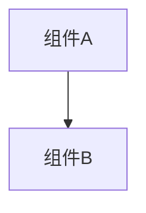

# 变更提案: fix-s2sql-field-extraction

## 元信息
```yaml
类型: 修复
方案类型: implementation
优先级: P0
状态: 已确认
创建: 2026-03-05
```

---

## 1. 需求

### 背景
在“销售数据分析助手”场景中，S2SQL → SQL 的转换会生成包含 JOIN 的查询。当前存在两类问题：
- JOIN 条件里的字段未被抽取进 `OntologyQuery.fields`，导致宽表 CTE（如 `t_27`）不投影 join key，后续 SQL 引用时报错（例如 `fis.product_key does not exist`）。
- S2SQL 中存在 `SUM(指标) AS 指标` 这类“alias 与指标同名”的写法时，解析阶段会误把指标从查询字段集合中剔除，导致指标无法被识别与展开，最终 SQL 引用中文名字段报错（例如 `column \"总销售金额\" does not exist`）。

### 目标
- 生成宽表 CTE 时，必须包含 JOIN ON/USING 条件中涉及的字段，避免 join key 丢失。
- 指标/字段解析时，不应因为 alias 与字段同名而丢失真实字段的语义识别。
- 修复后在浏览器端到端验证“销售数据分析助手”查询不再出现上述两类 SQL 执行错误。

### 约束条件
```yaml
时间约束: 尽量小改动、快速验证
性能约束: 字段抽取只做语法树遍历，不引入显著性能退化
兼容性约束: 仅增强字段抽取与解析容错，不改变正常 SQL 的语义
业务约束: 必须在本地 Supersonic（D:/vsx/metrics/supersonic）验证
```

### 验收标准
- [ ] `SqlSelectHelper.getAllSelectFields()` 能抽取 JOIN ON/USING 中的字段
- [ ] `SqlQueryParser` 不再因为 alias 与字段同名而丢失指标字段识别
- [ ] 浏览器中“销售数据分析助手”发起“每个产品的销售额”，最终执行 SQL 不再因 join key 丢失报错（例如 `product_key does not exist`）

---

## 2. 方案

### 技术方案
1) 增强 SQL 字段抽取：在 `SqlSelectHelper.getFieldsByPlainSelect(...)` 中补齐 JOIN 条件字段（ON/USING）。
2) 修复 S2SQL 解析误删字段：在 `SqlQueryParser.parse(...)` 中移除冗余的 `queryFields.removeAll(queryAliases)`，避免 `SUM(x) AS x` 这类写法把真实字段误删。
3) 补齐单测：覆盖 JOIN 字段抽取与 alias=字段名的指标识别场景。
4) 重启本地 Supersonic 并进行浏览器端到端验证。

### 影响范围
```yaml
涉及模块:
  - common: SQL 字段抽取增强（JOIN ON/USING）
  - headless-core: S2SQL 解析字段列表修复（避免 alias 误删）
预计变更文件: 3-5
```

### 风险评估
| 风险 | 等级 | 应对 |
|------|------|------|
| JOIN 条件解析覆盖不全（方言/语法差异） | 中 | 基于 JSqlParser AST 遍历，解析失败不影响现有逻辑；补单测覆盖 ON/USING |
| 解析字段集合变大导致宽表投影增加 | 低 | 仅补齐必要 join key，属于正确性修复 |

---

## 3. 技术设计（可选）

> 涉及架构变更、API设计、数据模型变更时填写

### 架构设计


### API设计
#### {METHOD} {路径}
- **请求**: {结构}
- **响应**: {结构}

### 数据模型
| 字段 | 类型 | 说明 |
|------|------|------|
| {字段} | {类型} | {说明} |

---

## 4. 核心场景

> 执行完成后同步到对应模块文档

### 场景: {场景名称}
**模块**: {所属模块}
**条件**: {前置条件}
**行为**: {操作描述}
**结果**: {预期结果}

---

## 5. 技术决策

> 本方案涉及的技术决策，归档后成为决策的唯一完整记录

### fix-s2sql-field-extraction#D001: JOIN 条件字段必须进入宽表投影
**日期**: 2026-03-05
**状态**: ✅采纳
**背景**: JOIN ON/USING 字段缺失会导致宽表 CTE 缺列，后续 SQL 引用直接失败
**选项分析**:
| 选项 | 优点 | 缺点 |
|------|------|------|
| A: 在 `SqlSelectHelper` 字段抽取中补 JOIN 解析 | 改动集中、可复用、对上层透明 | 需要覆盖 ON/USING 的 AST 结构 |
| B: 在 SQL Builder 中硬编码补齐 join key | 局部修补、实现快 | 侵入 SQL 生成逻辑、难以覆盖更多场景 |
**决策**: 选择方案 A
**理由**: 字段抽取属于底层能力，集中修复能让所有上层逻辑受益并降低长期维护成本
**影响**: common 模块（SqlSelectHelper）
