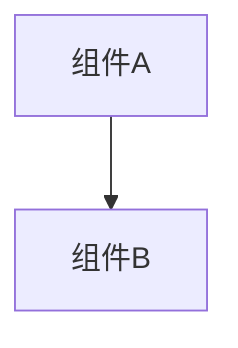

# 变更提案: fix-drilldown-entry

## 元信息
```yaml
类型: 修复
方案类型: implementation
优先级: P1
状态: 待实施
创建: 2026-03-06
```

---

## 1. 需求

### 背景
“问答对话 / 销售数据分析助手”里，图表结果卡片底部原本会展示维度下钻/上钻入口（推荐可下钻维度列表 + 取消下钻）。近期该入口消失，导致用户无法继续按维度层级探索数据。

目前前端 `chat-sdk` 的渲染逻辑是：只有在消息结果包含 `recommendedDimensions`（后端推荐下钻维度）时才渲染下钻入口；否则整个入口区块不显示。

初步推断：后端未再返回 `recommendedDimensions`（常见原因是语义层 schema 中 metric 的 `relatedSchemaElements` 为空，推荐处理器无法产出维度）。

### 目标
- 恢复图表卡片的下钻/上钻入口展示（不改变既有交互形态）。
- 当 metric 未单独配置下钻维度、但模型配置了默认下钻维度时，仍能推荐维度并在前端展示。

### 约束条件
```yaml
时间约束: 优先快速恢复功能，避免大范围重构
性能约束: 不应引入明显的额外 DB/网络开销（schema 构建属于高频路径）
兼容性约束: 保持 API 兼容；不影响已配置 metric 下钻维度的行为
业务约束: 不新增/改变权限判定逻辑
```

### 验收标准
- [ ] 对“销售数据分析助手”生成的图表结果，页面可见下钻维度入口（推荐维度列表）；点击后可触发下钻；取消后可上钻恢复。
- [ ] 后端对仅配置“模型默认下钻维度”的 metric 查询，返回的 `QueryResult.recommendedDimensions` 非空。
- [ ] 单测覆盖“metric 无 relateDimension、model 有 drillDownDimensions”场景，验证 `MetricSchemaResp.relateDimension.drillDownDimensions` 被正确补齐。

---

## 2. 方案

### 技术方案
在 headless 层构建 schema 时，当前 `DataSetSchemaBuilder` 仅基于 `MetricSchemaResp.relateDimension.drillDownDimensions` 构建 metric 的 `relatedSchemaElements`，而 `SchemaServiceImpl.convert(MetricResp)` 仅做 `BeanUtils.copyProperties`，导致模型默认下钻维度无法进入 schema。

修复思路：在 `SchemaServiceImpl` 生成 `MetricSchemaResp` 时，将 **metric 自身配置** 与 **model 默认配置** 的下钻维度进行合并（去重），并写回 `MetricSchemaResp.relateDimension.drillDownDimensions`，使 `DataSetSchemaBuilder` 能构建出 `relatedSchemaElements`，从而让 `DimensionRecommendProcessor` 产出 `recommendedDimensions`，前端恢复入口展示。

性能策略：合并逻辑优先使用 `SchemaServiceImpl.buildDataSetSchema` 已批量拉取到的 `ModelResp`（含 `drillDownDimensions`），避免为每个 metric 额外调用 `metricService.getDrillDownDimension` 触发重复 DB 查询。

### 影响范围
```yaml
涉及模块:
  - headless/server: Schema 构建时补齐 metric 的下钻维度（影响推荐下钻维度生成）
  - chat/server: 无需改动（推荐维度来源不变，依赖 schema 修复）
  - webapp/chat-sdk: 无需改动（渲染逻辑依赖 recommendedDimensions）
预计变更文件: 2~3
```

### 风险评估
| 风险 | 等级 | 应对 |
|------|------|------|
| schema 构建逻辑变化导致推荐维度变化 | 中 | 单测覆盖 + 仅补齐“缺失的模型默认下钻维度”，不移除现有配置 |
| 性能回退（多次拉取 model/metric） | 中 | 使用已加载的 `ModelResp.drillDownDimensions` 做内存合并，避免 per-metric DB 调用 |

---

## 3. 技术设计（可选）

> 涉及架构变更、API设计、数据模型变更时填写

### 架构设计


### API设计
#### {METHOD} {路径}
- **请求**: {结构}
- **响应**: {结构}

### 数据模型
| 字段 | 类型 | 说明 |
|------|------|------|
| {字段} | {类型} | {说明} |

---

## 4. 核心场景

> 执行完成后同步到对应模块文档

### 场景: 图表结果展示下钻入口
**模块**: chat-sdk（前端渲染） / chat-server（推荐维度） / headless（schema 构建）
**条件**: 查询为聚合类（含 metrics），并且 metric 可下钻维度可被推荐
**行为**: 后端返回 `recommendedDimensions` → 前端渲染推荐维度列表 → 用户点击维度触发下钻；点击“取消下钻”触发上钻
**结果**: 用户可在同一对话线程中按维度层级探索指标数据

---

## 5. 技术决策

> 本方案涉及的技术决策，归档后成为决策的唯一完整记录

### fix-drilldown-entry#D001: 在 schema 构建阶段合并模型默认下钻维度
**日期**: 2026-03-06
**状态**: ✅采纳
**背景**: 下钻入口依赖 `recommendedDimensions`，其唯一来源是基于 schema 中 metric 的 `relatedSchemaElements` 推荐。当前 schema 未包含模型默认下钻维度，导致推荐为空。
**选项分析**:
| 选项 | 优点 | 缺点 |
|------|------|------|
| A: 修改 `DataSetSchemaBuilder.getRelateSchemaElement` 直接调用 `MetricService.getDrillDownDimension` | 改动集中 | `DataSetSchemaBuilder` 是纯构建工具，强耦合 Service；且会引入 per-metric 额外调用风险 |
| B: 修改 `SchemaServiceImpl` 生成 `MetricSchemaResp` 时补齐 `relateDimension.drillDownDimensions`（合并 metric+model） | 保持构建工具纯粹；可复用已批量加载的 `ModelResp`，性能更稳 | 需要在 `SchemaServiceImpl` 内实现合并逻辑并加单测 |
**决策**: 选择方案 B
**理由**: 最贴合数据流，避免引入不必要的 service 依赖与性能回退；同时符合“schema response 应包含完整可下钻信息”的直觉。
**影响**: headless/server 的 schema 构建输出更完整，进而恢复 chat 层推荐与前端入口展示。
