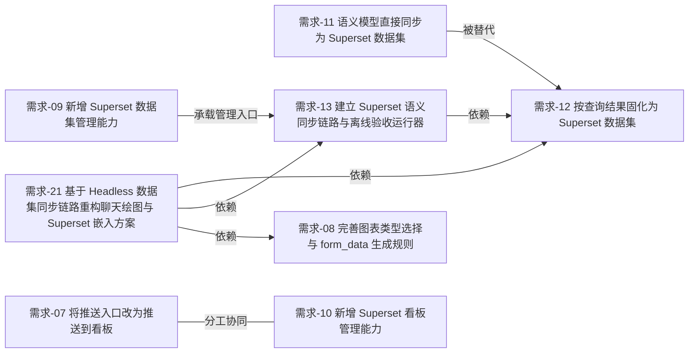

# Supersonic 需求关系图

## 文字关系

- [将语义模型直接同步为 Superset 数据集](需求/将语义模型直接同步为Superset数据集.md) 已被 [按查询结果固化为 Superset 数据集](需求/按查询结果固化为Superset数据集.md) 替代。
- [建立 Superset 语义同步链路与离线验收运行器](需求/建立Superset语义同步链路与离线验收runner.md) 依赖 [按查询结果固化为 Superset 数据集](需求/按查询结果固化为Superset数据集.md)。
- [基于 Headless 数据集同步链路重构聊天绘图与 Superset 嵌入方案](需求/基于headlessdataset同步链路重构聊天绘图与Superset嵌入方案.md) 依赖：
  - [按查询结果固化为 Superset 数据集](需求/按查询结果固化为Superset数据集.md)
  - [建立 Superset 语义同步链路与离线验收运行器](需求/建立Superset语义同步链路与离线验收runner.md)
  - [完善图表类型选择与 form_data 生成规则](需求/完善图表类型选择与form_data生成规则.md)
- [将推送入口改为推送到看板](需求/将推送入口改为推送到看板.md) 与 [新增 Superset 看板管理能力](需求/新增Superset看板管理能力.md) 是分工关系：
  - 前者解决聊天链路里的“推送目标与过滤”问题。
  - 后者解决顶级管理页里的“手工看板生命周期”问题。
- [新增 Superset 数据集管理能力](需求/新增Superset数据集管理能力.md) 为 [建立 Superset 语义同步链路与离线验收运行器](需求/建立Superset语义同步链路与离线验收runner.md) 提供管理入口承载。

## Mermaid 关系图

